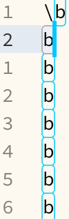
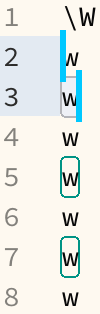

# Sublime AppendSelection plugin

Provides replacement for default sublime cursors appending.


### Demo


### Reason

Sublime default "find_under_expand" worked pretty well but there was not enough
options for me. I added direction control (e.g. look backward/forward) and
search type (find part of word or whole word).


### Installation

This plugin is part of [sublime-enhanced](http://github.com/shagabutdinov/sublime-enhanced)
plugin set. You can install sublime-enhanced and this plugin will be installed
automatically.

If you would like to install this package separately check "Installing packages
separately" section of [sublime-enhanced](http://github.com/shagabutdinov/sublime-enhanced)
package.


### Features

1. Select text forward
2. Select text backward
3. Select word forward
4. Select word forward


### Usage

Select a text or position cursor on top of word that should be selected several
times. Hit keyboard shortcuts to add next or previous occurence of word to
cursors. You can also skip last cursor and go to next selection.


### Commands

| Description          	|                	|                	|               	| Key          	| Command palette                       |
|----------------------	|----------------	|----------------	|---------------	|--------------	|---------------------------------------|
| Append next          	|                	|                	| <kbd>alt</kbd>	| <kbd>c</kbd> 	| AppendSelection: append next          |
| Append previous      	|<kbd>shift</kbd>	|                	| <kbd>alt</kbd>	| <kbd>c</kbd> 	| AppendSelection: append previous      |
| Append next word     	|                	|<kbd>ctrl</kbd> 	| <kbd>alt</kbd>	| <kbd>c</kbd> 	| AppendSelection: append next word     |
| Append previous word 	|<kbd>shift</kbd>	|<kbd>ctrl</kbd> 	| <kbd>alt</kbd>	| <kbd>c</kbd> 	| AppendSelection: append previous word |
| Skip cursor          	|<kbd>shift</kbd>	|<kbd>ctrl</kbd> 	|               	| <kbd>c</kbd> 	| AppendSelection: skip last            |

### Command arguments

```json5
{"keys":["alt+4"],"command":"append_seletion","args":{
 //↓argument            	↓default	, // comment
 "word"                 	:true   	, // select by word boundary
 "wordb"                	:true   	, // word boundary \b or \W (old behavior), see screenshots below for comparison
 "backward"             	:false  	, // select backwards
 "skip"                 	:false  	, // skip/move current selection (deselect it) instead of appending to it (previous selections remain)
 "repeat_last_with_skip"	:false  	, // replaces the word/wordb/backward/skip arguments with those of the last invoked command
}},
```

`wordb=true`  vs `false` 

### Configure

User configuration file `AppendSelection.sublime-settings`

`"reg_flags": ["DRAW_EMPTY","DRAW_NO_FILL",],` A list of v4132 [highlight flag](sublimetext.com/docs/api_reference.html#sublime.RegionFlags)

### Dependencies

None
